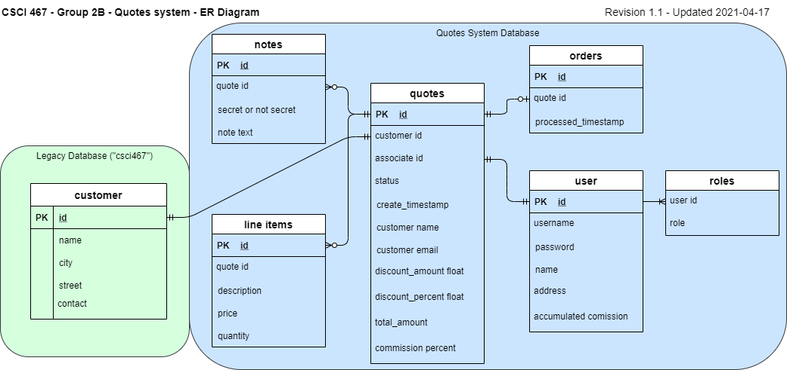

# SQL directory

This directory contains scripts needed to prepare the database. The database is documented below.

## Database Schema

The application connects to two databases.

* A read-only connection to an existing MySQL database ("Legacy Database") containing customer information
* A read-write connection to a new database ("System Database") for the application data

### Legacy Database

**customer**(<ins>id</ins>, name, city, street, contact) 

### System Database

**user**(<ins>id</ins>, username, password, name, address, accumulated_commission)

**role**(<ins>user_id †, role</ins>)

> * user_id references user(id)

**quote**(<ins>id</ins>, customer_id †, associate_id †, status, create_timestamp, customer_name, discount_amount, iscount_percent, total_amount, comission_percent)

> * customer_id references a table attribute, *customer(id)*, in another database, *csci467*, so it is not  a foreign key in in the table schema, but the constraint will be managed by the application instead
> * associate_id references user(id) 

**note**(<ins>id</ins>, quote_id†, secret, text)

> * quote_id references quote(id)

**line_item**(<ins>id</ins>, quote_id†, description, quantity)

> * quote_id references quote(id)

**order**(<ins>id</ins>, quote_id†, processed_timestamp)

> * quote_id references quote(id)

## ER Diagram



## ER Diagram Description

### Legacy Database

#### customer

| attribute/col name  | data type    | domain                  | example          | description                    |
|---------------------|--------------|-------------------------|------------------|--------------------------------|
| id                  | INT          | 1 to 161                | 25               | auto increment primary key     |
| name                | VARCHAR(50)  | "a" to "ZZZZZZ..."(50)  | Easy Tech        | customer name                  |
| city                | VARCHAR(50)  | "a" to "ZZZZZZ..."(50)  | Chicago, IL      | customer city                  |
| street              | VARCHAR(50)  | "a" to "ZZZZZZ..."(50)  | 123 Any St.      | customer street address        |
| contact             | VARCHAR(50)  | "a" to "ZZZZZZ..."(50)  | user@example.com | customer phone/e-mail/website  |

### System Database

#### user

| attribute/col name      | data type     | domain                   | example                                                       | description                                             |
|-------------------------|---------------|--------------------------|---------------------------------------------------------------|---------------------------------------------------------|
| id                      | INT           | positive integers        | 3                                                             | auto increment primary key                              |
| username                | VARCHAR(191)  | "a" to "ZZZZZZ..."(191)  | admin                                                         | user login id with no spaces                            |
| password                | VARCHAR(255)  | valid bcrypt hashes      | $2y$10$Y8PFxVRLxLIqaN6ZsCyqdubF5HuLNeDLm.FEwWuBHgDWkG6iFn.NK  | salted bcrypt password hashes from php password_hash()  |
| name                    | VARCHAR(255)  | "a" to "ZZZZZZ..."(255)  | Charlie Brown                                                 | user/associate name                                     |
| address                 | VARCHAR(255)  | "a" to "ZZZZZZ..."(255)  | 123 Any St.                                                   | user street address                                     |
| accumulated_commission  | DECIMAL(9,2)  | 0.00 to 9,999,999.99     | 23.67                                                         | associate earnings                                      |

#### role

| attribute/col name  | data type  | domain                           | example    | description                |
|---------------------|------------|----------------------------------|------------|----------------------------|
| user_id             | INT        | positive integers                | 3          | user(id)                   |
| role                | ENUM       | ("admin", "associate", "clerk")  | Associate  | a role assigned to a user  |

#### quote

| attribute/col name  | data type     | domain                                       | example     | description                                        |
|---------------------|---------------|----------------------------------------------|-------------|----------------------------------------------------|
| id                  | INT           | positive integers                            | 5           | auto increment primary key                         |
| customer_id         | INT           | 1-161                                        | 25          | customer(id)                                       |
| associate_id        | INT           | positive integers                            | 3           | user(id)                                           |
| status              | ENUM          | ("unsanctioned", "sanctioned", "processed")  | sanctioned  | quote status                                       |
| create_timestamp    | TIMESTAMP     | unix time                                    | 1617540140  | time quote was created                             |
| customer_name       | VARCHAR(255)  | words                                        | Asus Tech   | customer(name)                                     |
| discount_amount     | DECIMAL(9,2)  | 0.00 to 9,999,999.99                         | 25.00       | dollar amount to subtract from the quote subtotal  |
| discount_percent    | DECIMAL(2,0)  | 00 to 99                                     | 10          | percent to remove from the subtotal                |
| total_amount        | DECIMAL(9,2)  | 0.00 to 9,999,999.99                         | 1,500.00    | running total of all items                         |
| commission_percent  | DECIMAL(2,0)  | 00 to 99                                     | 03          | associate comission percent                        |

#### line_item

| attribute/col name  | data type     | domain             | example                       | description                   |
|---------------------|---------------|--------------------|-------------------------------|-------------------------------|
| id                  | INT           | positive integers  | 1                             | auto increment primary key    |
| quote_id            | INT           | positive integers  | 5                             | quote(id)                     |
| description         | VARCHAR(255)  | words              | Turboencabulator maintenance  | description of the line item  |
| quantity            | INT           | positive integers  | 3                             | how many of the item          |

#### note

| attribute/col name  | data type  | domain                     | example     | description                 |
|---------------------|------------|----------------------------|-------------|-----------------------------|
| id                  | INT        | positive integers          | 1           | auto increment primary key  |
| quote_id            | INT        | positive integers          | 5           | quote(id)                   |
| secret              | BOOLEAN    | true or false              | false       | secret or not secret        |
| text                | TEXT       | chars and symbols (64KiB)  | rush order  | note text                   |

#### order

| attribute/col name   | data type    | domain                  | example                  | description                    |
|----------------------|--------------|-------------------------|--------------------------|--------------------------------|
| id                   | VARCHAR(50)  | "a" to "ZZZZZZ..."(50)  | 6068f77d7bf51e4654f6be3  | auto increment primary key     |
| quote_id             | INT          | positive integers       | 5                        | quote(id)                      |
| processed_timestamp  | TIMESTAMP    | unix time               | 1617540140               | date from external processing  |

## SQL scripts

### Create Tables

```sql
# tables.sql
```
